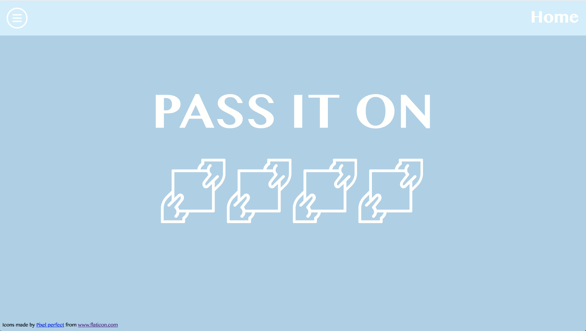
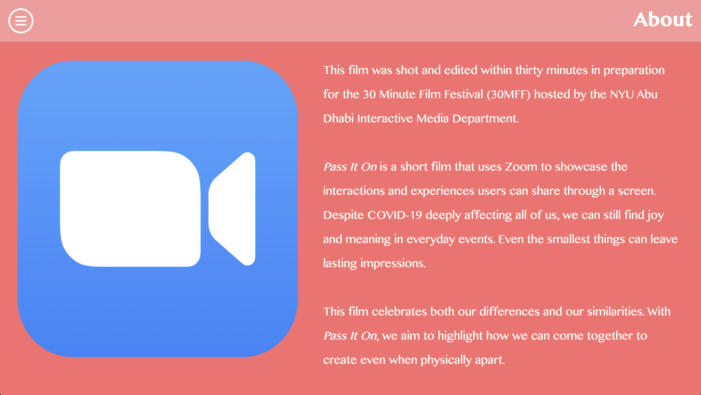
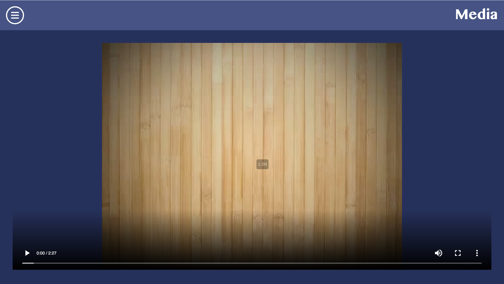
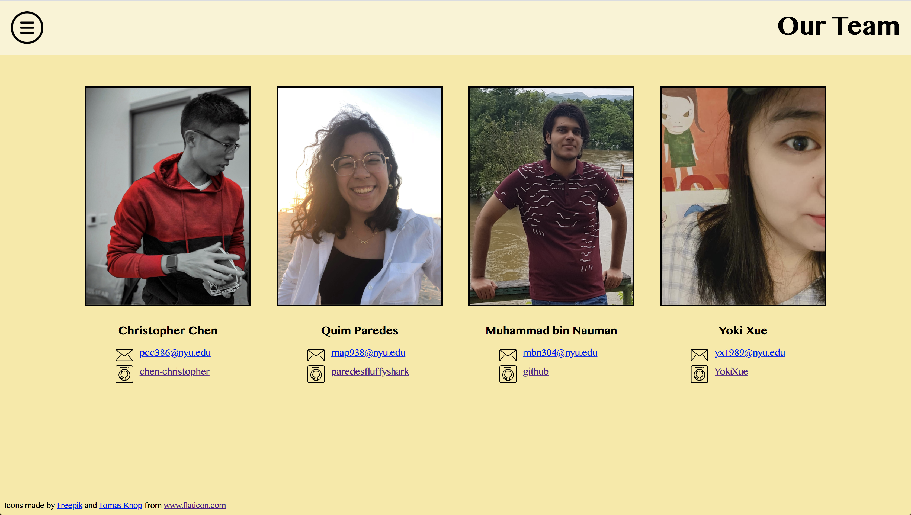

# *Pass It On*

*Pass It On* is a short film created for the 30 Minutes Film Festival (30MFF). It was created and edited within thirty minutes. 

This film is a screen capture of our team, Quim Paredes, Muhammad bin Nauman, Yoki Xue, and me (Christopher Chen), in a Zoom meeting. In this film, we're passing objects to each other as if we were physically nearby. We hoped to create something that was fun and uplifting within the constraints of a virtual meeting. COVID-19 has put a wrench in most of our plans and we aimed to make the most out of the situation. Even though we're different people with unique backgrounds, we all share some similarities. This film celebrates these similarities and differences while sending an important message: we can all come together to collaborate creatively. 

To implement this concept, we first identified our shared objects. We also wanted to incoporate something we held close to our identity: our nationality. The rest of the objects were common everyday things that would use such as a pen, a water bottle, and earphones. Additionally, in the midst of a global pandemic, masks are necessary (although we most definitely should not share masks).

For my website, there are four pages: Home, About, Media, and Our Team. The main theme of this website is the color scheme. Most of the colors are either soothing or warm.

*This is the Home page:*

*This is the About page:*

*This is the Media page:*

*This is the Our Team page:*

I main interactions are the burger menu and the dropdown. When you hover over the burger menu, the opacity of it drops to indicate that you are able to click it. 

Initially, we were completely lost when given the task of creating and editing a film within thirty minutes. We pitched various ideas such as playing with apples and recent Tik Tok trends. However, none of these ideas really stuck until Quim started asking if we had similar objects. From there, we decided to pass items to each other as if we were physically together. Once we decided upon our items (passport, water bottle, phone, earphones, and masks) we started screen recording. Lastly, we picked cheerful music to fit with the overall tone of the story. 

When we were creating the short film, I didn't have any expectations other than creating the film within the given time constraints. The results definitely exceeded my expectations and we had fun filming and editing. Through the transferring of objects, we realized that we share numerous similarities even though we hardly knew each other. 

When I was creating the wire frame for my website, I thought that I was simply creating a website to host the short film; I did not design the website with the story in mind. However, my initial design seemed to mesh with the story quite well. The colors that I chose were bright and warm, coinciding with the tone of the film. Although I failed to implement all of the functionalities in my wireframe, I am content with the final product. CSS positioning was much tougher than it seemed, but I managed to make it work (on my screen at least) while including JavaScript elements such as hovering and the dropdown menu. There is definitely much more that I can add to this, but within the given time frame, I am happy with the end result.

